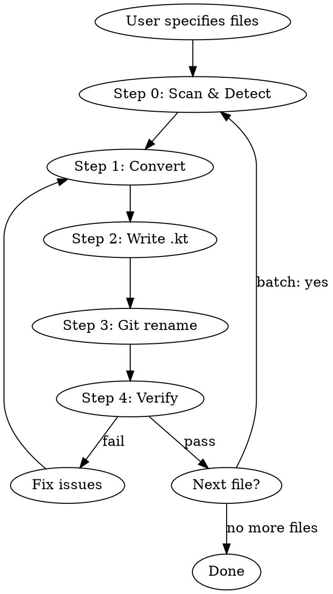

# Java to Kotlin Conversion

Convert Java source files to idiomatic Kotlin using a disciplined 4-step
conversion methodology with 5 invariants checked at each step. Keep Java for
Fabric Mixins, accessors, and bytecode-sensitive Minecraft glue unless there is
clear evidence Kotlin is the right boundary.

## Workflow



## Step 0: Scan Scope

Before converting, scan the Java file and nearest `AGENTS.md` to confirm the
file is not Fabric Mixin/accessor or bytecode-sensitive Minecraft glue that
should remain Java. If conversion is appropriate, preserve package names,
public API shape, annotations, and runtime behavior.

## Step 1: Convert

Apply the conversion methodology from [CONVERSION-METHODOLOGY.md](references/CONVERSION-METHODOLOGY.md).

This is a 4-step chain-of-thought process:
1. **Faithful 1:1 translation** — exact semantics preserved
2. **Nullability & mutability audit** — val/var, nullable types
3. **Collection type conversion** — Java mutable → Kotlin types
4. **Idiomatic transformations** — properties, string templates, lambdas

Five invariants are checked after each step. If any invariant is violated, revert
to the previous step and redo.

Keep Craftless stack rules in force during step 4: Ktor for JVM HTTP
boundaries, kotlinx.serialization for JSON contracts, and no old Java HTTP
stack or static Minecraft action surface.

## Step 2: Write Output

Write the converted Kotlin code to a `.kt` file with the same name as the original
Java file, in the same directory.

## Step 3: Preserve Git History

To preserve `git blame` history, use a two-phase approach:

```bash
# Phase 1: Rename (creates rename tracking)
git mv src/main/java/com/example/Foo.java src/main/kotlin/com/example/Foo.kt
git commit -m "Rename Foo.java to Foo.kt"

# Phase 2: Replace content (tracked as modification, not new file)
# Write the converted Kotlin content to Foo.kt
git commit -m "Convert Foo from Java to Kotlin"
```

If the project keeps Java and Kotlin in the same source root (e.g., `src/main/java/`),
rename in place:

```bash
git mv src/main/java/com/example/Foo.java src/main/java/com/example/Foo.kt
```

If the project does not use Git, simply write the `.kt` file and delete the `.java` file.

## Step 4: Verify

After conversion, verify using [checklist.md](assets/checklist.md):
- Attempt to compile the converted file
- Run existing tests
- Check annotation site targets
- Confirm no behavioral changes

## Batch Conversion

When converting multiple files (a directory or package):

1. **List all `.java` files** in the target scope
2. **Sort by dependency order** — convert leaf dependencies first (files that don't
   import other files in the conversion set), then work up to files that depend on them
3. **Convert one file at a time** — apply the full workflow (steps 0-4) for each
4. **Track progress** — report which files are done, which remain
5. **Handle cross-references** — after converting a file, update imports in other Java
   files if needed (e.g., if a class moved packages)

For large batches, consider converting in packages (bottom-up from leaf packages).

## Common Pitfalls

See [KNOWN-ISSUES.md](references/KNOWN-ISSUES.md) for:
- Kotlin keyword conflicts (`when`, `in`, `is`, `object`)
- SAM conversion ambiguity
- Platform types from Java interop
- `@JvmStatic` / `@JvmField` / `@JvmOverloads` usage
- Checked exceptions and `@Throws`
- Wildcard generics → Kotlin variance
